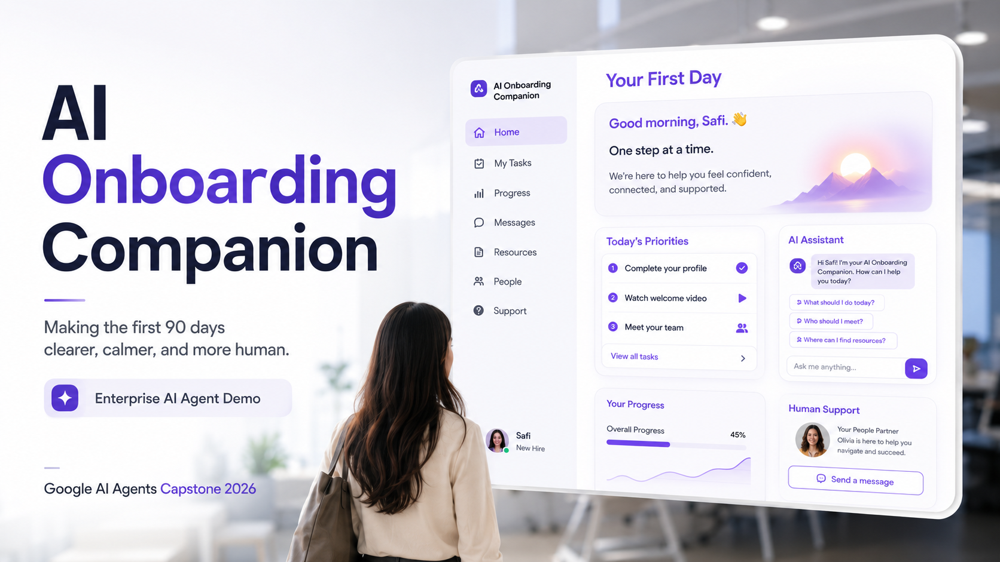
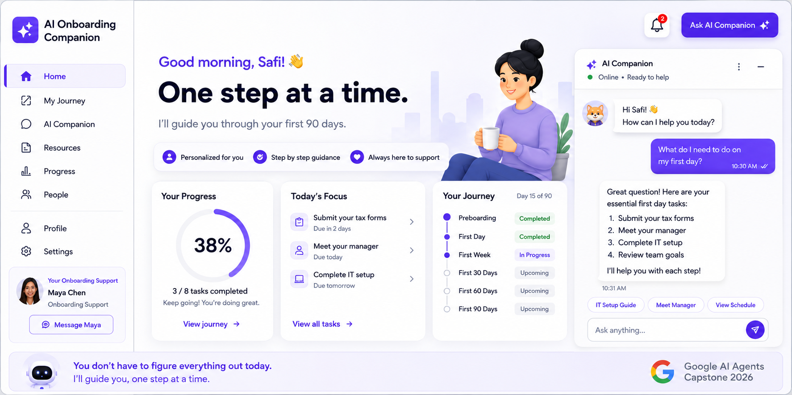
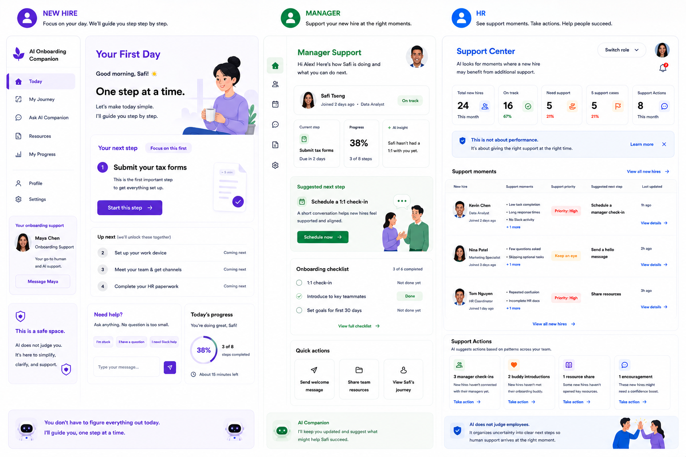
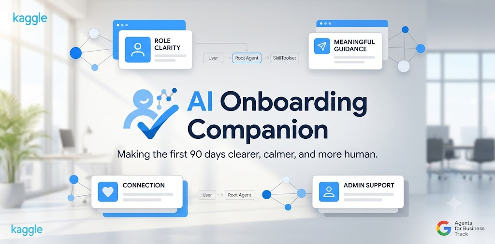

# AI Onboarding Companion

### 讓入職的前 90 天更清晰、更從容、更有人味。

[觀看示範影片](https://youtu.be/969dEPjpEXE) | [Kaggle Writeup](https://www.kaggle.com/competitions/vibecoding-agents-capstone-project/writeups/ai-onboarding-companion) | [English README](README.md)



AI Onboarding Companion 是一個使用 Google Agent Development Kit (ADK) 建立的企業級 AI Agent，目標是支持新人在入職前 90 天的適應旅程。

它不只是回答問題，而是幫助新人知道下一步該做什麼、處理日常入職疑問、減少 HR 的重複協調工作，並在需要真人判斷或支持時，協助主管或 HR 於正確時刻介入。

這個 Agent 協調新人在「人、工作系統、入職流程」之間的組織社會化旅程。

---

## 產品截圖

### 新人端體驗



個人化入職儀表板，透過 AI 引導新人走過前 90 天的入職旅程。

### 多角色支持視角



互動式產品 Demo 展示同一段入職旅程如何同時支持新人、主管與 HR 團隊。

### Agent 架構



本專案使用 Google ADK root agent、模組化 Skills、工具化工作流程、共享入職記憶，以及針對敏感操作的人工審核 (Human-in-the-Loop)。

---

## 為什麼做這個專案？

新人入職是組織內最需要跨角色協作的流程之一。

新人需要完成文件、參加訓練、申請系統權限、學習新工具，也要理解日常工作實際如何運作。與此同時，HR 追蹤進度、主管安排入職活動，IT 準備帳號與權限。

這些活動雖然目標一致，卻常常分散在不同團隊與系統之中，造成入職流程耗時、零散且體驗不一致。

AI Onboarding Companion 的目標，是在改善新人入職體驗的同時，簡化這些協調成本。

> **從文書作業，到歸屬感。**
>
> 多數入職系統管理的是任務。  
> AI Onboarding Companion 引導的是人的組織社會化旅程。

---

## 差異在哪裡？

傳統入職系統主要關注流程是否完成。

AI Onboarding Companion 關注的是新人能否順利走過入職旅程。

它不只是追蹤任務完成，而是：

- 為新人提供情境化引導
- 在小問題變成阻礙前先回應
- 減少 HR 的重複協調工作
- 幫助主管知道何時支持最重要
- 將入職活動轉化為有意義的進展

成功不只是完成任務。

成功是新人能否在前 90 天變得有生產力、有連結感，並對自己的角色更有信心。

每一個入職活動，都是在正確時刻，為正確的人提供正確支持的機會。

---

## 一個事件，三種視角

每一個入職事件，都會為不同角色創造不同價值。

| 角色 | 傳統入職 | AI Onboarding Companion |
|---|---|---|
| 新人 | 收到確認通知 | 收到清楚的下一步引導與有意義的支持 |
| HR | 手動追蹤進度 | 自動更新里程碑並看見支持時刻 |
| 主管 | 對進度能見度有限 | 知道新人何時準備好進入下一階段 |

同一個入職事件，會為不同利害關係人產生不同資訊。

Agent 透過單一工作流程協調這些視角。

---

## 核心 Skills

Agent 結合四個互補的 Skills。

### 1. Administrative Support

引導新人完成入職行政任務，例如文件、設備設定、系統權限、必修訓練與常見流程問題。

範例包含 HR 文件、筆電領取、Slack 設定、權限申請、請假流程、報修流程與入職清單。

### 2. Role Clarity

幫助員工理解優先事項、期待，以及下一步應該專注什麼。

它不是丟出一長串任務，而是推薦最相關的下一步，並解釋為什麼這件事重要。

### 3. Connection and Socialization

幫助新人理解人、流程與日常職場慣例。

這包含許多不一定寫在文件裡的問題，例如該問誰、資源在哪裡、內部流程怎麼走、附近午餐怎麼解決、停車怎麼處理，以及日常工作的非正式慣例。

Agent 會先處理日常入職疑問；只有在需要真人判斷或支持時，才升級給 HR、主管、IT 或其他人員。

### 4. Meaning

將完成的入職活動轉化為有意義的回饋：

**Behavior -> Motivation -> Value -> Meaning**

它不只是確認任務完成，而是幫助新人理解每一步如何讓自己逐漸成為組織的一部分。

Meaning 回饋以可觀察行為為基礎。Agent 不會在沒有事實依據的情況下稱讚或評價員工。

---

## 技術亮點

本專案展示了一個以 Google ADK 建立的企業導向 AI Agent。

主要實作包含：

- `onboarding_companion/agent.py`：使用 SkillToolset 的 Google ADK root agent
- `onboarding_companion/tools.py`：六個自訂入職工具與共享記憶
- `skills/*/SKILL.md`：四個模組化 Skill 定義
- `ONBOARDING_DB`：儲存任務、聯絡人、行為、成就、連結與適應狀態的共享入職記憶
- `request_hitl_approval()`：敏感操作的人工作業審核
- `confirm_meaning_delivered()`：Meaning Score 的閉環更新
- `eval/test_cases.json`：評估情境
- `eval/priority_and_privacy.feature`：優先級邏輯與隱私保護的 Gherkin 規格

這個專案展示的是 AI Agent 如何協調人、工具、記憶與工作流程，而不只是回答問題。

---

## Demo 流程

1. 新人打開 **Your First Day**。
2. Agent 推薦下一個入職步驟。
3. 使用者在 safe-to-ask 介面中提出日常入職問題。
4. 使用者完成一項入職任務。
5. Role Clarity、Connection and Socialization、Meaning Skills 提供個人化引導。
6. 敏感權限申請觸發 Human-in-the-Loop 人工審核。
7. HR 在 **Support Center** 中查看支持時刻。

---

## 本機執行

ADK web app 需要使用者自己的 Gemini API key。

```bash
pip install -r requirements.txt
cp .env.example .env
# 編輯 .env: GOOGLE_GENAI_API_KEY=your_key_here
adk web .
```

開啟 http://localhost:8000 並選擇 `onboarding_companion`。

可以嘗試以下提示詞：

```text
Hi, I'm Safi. It's my first day!
What should I focus on today?
I just picked up my laptop from Kevin.
I need help setting up Slack. Who should I ask?
Can you give me access to the finance dashboard?
How am I doing so far?
```

本專案也包含前端互動式產品 Demo UI。這個靜態 Demo 不需要 API key：

```text
interactive_demo/index.html
```

---

## 專案結構

```text
repo root
  agent.py                         Root ADK re-export
  onboarding_companion/
    agent.py                       Google ADK root agent with SkillToolset
    tools.py                       Onboarding tools and ONBOARDING_DB memory
  skills/
    administrative-support/SKILL.md
    role-clarity/SKILL.md
    connection/SKILL.md
    meaning/SKILL.md
  eval/
    test_cases.json                Evaluation scenarios
    priority_and_privacy.feature   Gherkin spec for priority + privacy
  interactive_demo/                Frontend-only interactive product demo UI
    index.html
    script.js
    style.css
  images/
    ai-onboarding-companion-hero.png
    new-hire-dashboard.png
    multi-role-dashboard.png
    agent-architecture.png
  video/
    AI_Onboarding_Companion_Demo.mp4
  submission/                      Submission assets and links
    kaggle_writeup.md
    submission_checklist.md
    youtube-link.txt
    github-link.txt
  AGENTS.md                        System blueprint
  run_demo.py                      Scripted demo conversation
  requirements.txt
  .env.example
```

---

## 設計原則

- 以人為中心的 AI
- One step at a time
- Safe-to-Ask 互動
- 以事實為基礎的回饋
- 敏感操作採 Human-in-the-Loop
- 隱私意識設計
- 關注支持時刻，而不是績效評分

---

## 未來 Roadmap

目前原型聚焦於入職體驗。

未來企業版能力包含：

- 身分驗證
- Role-Based Access Control
- 稽核紀錄
- 安全文件處理
- HRIS 整合
- Calendar、Slack、Microsoft 365 或 Google Workspace 整合
- 工作流程自動化

---

## 授權

程式碼採 MIT 授權。Kaggle 提交素材基於競賽用途，以 CC BY 4.0 提供。

---

## 願景

每個組織都會迎接新員工。

但不是每個組織都有資源提供完整且結構化的入職體驗。

AI Onboarding Companion 希望幫助各種規模的組織，提供更協調、更有支持感、更有人味的入職體驗。

AI 的角色是支持人。

而不是取代人。


